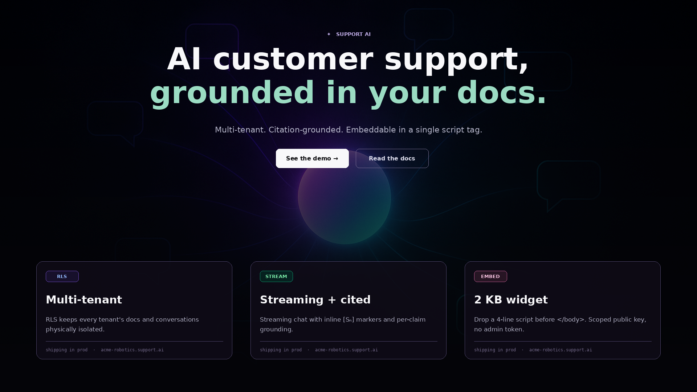
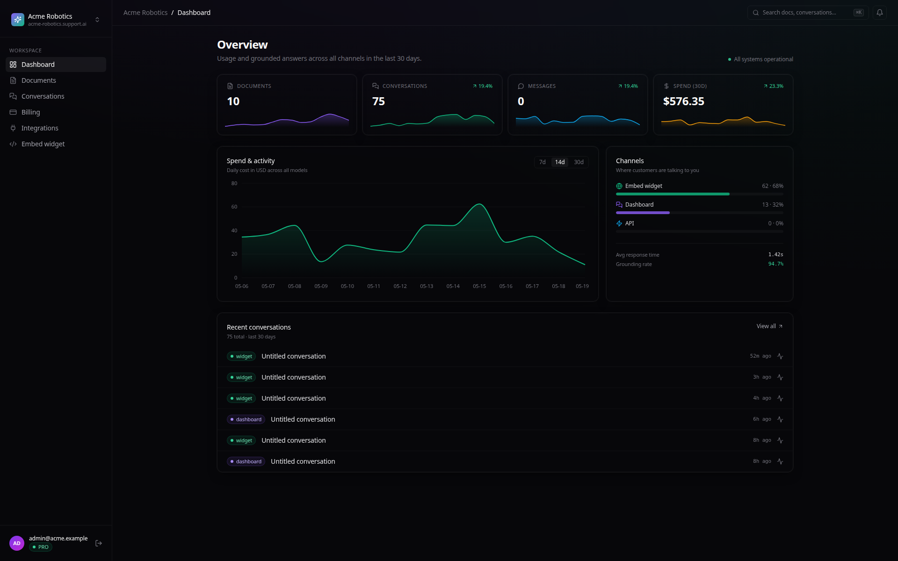
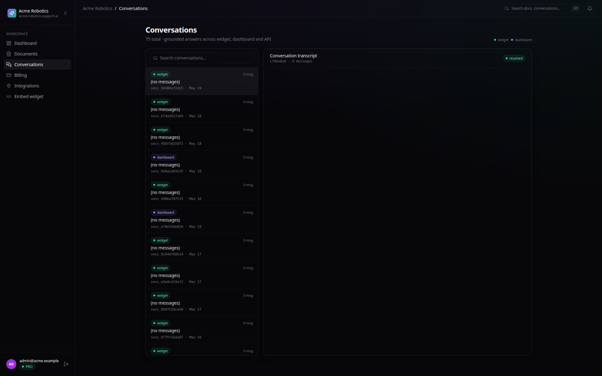
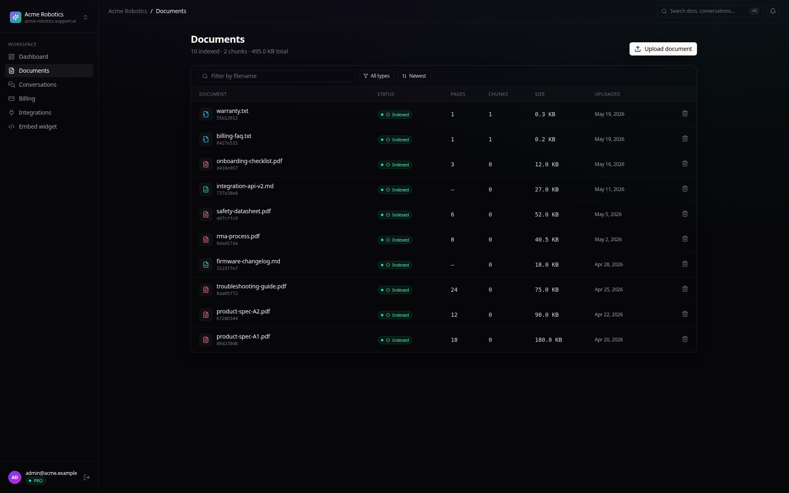
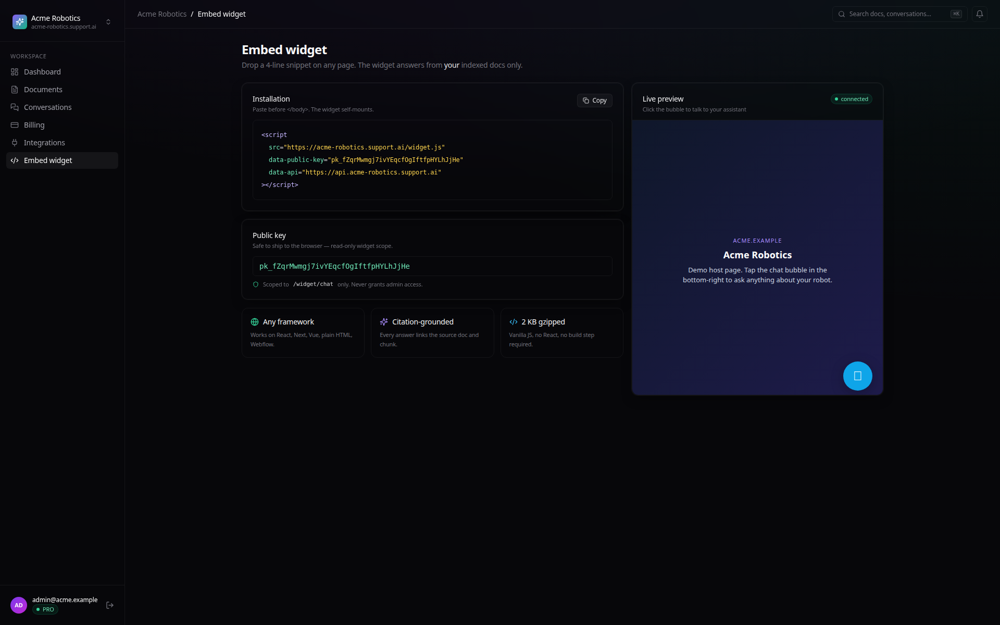
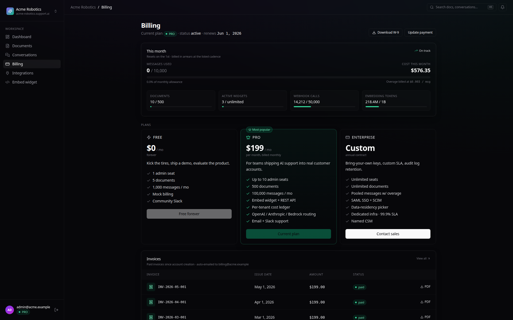
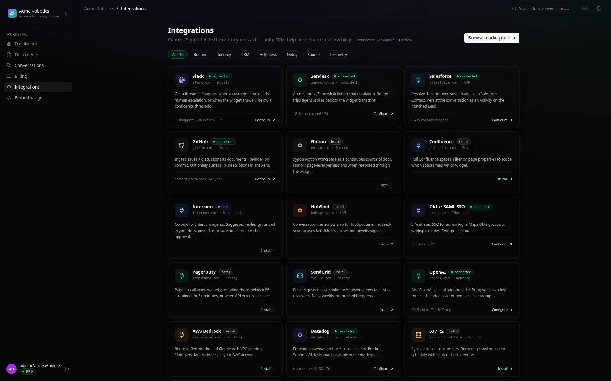

<div align="center">

# Support AI

**Multi-tenant customer-support SaaS with Postgres row-level security, streaming citation-grounded chat, a 2 KB embeddable widget, a per-tenant cost ledger, and dual-mode auth + billing.**



[](https://www.python.org/)
[](https://nextjs.org/)
[](https://www.postgresql.org/docs/current/ddl-rowsecurity.html)
[](https://stripe.com/)
[](https://www.anthropic.com/)
[](LICENSE)

</div>

---

## Table of Contents

- [Overview](#overview)
- [Features](#features)
- [Screenshots](#screenshots)
- [Tech Stack](#tech-stack)
- [Installation](#installation)
- [Architecture](#architecture)
- [Testing](#testing)
- [Author](#author)
- [License](#license)

## Overview

Support AI is an end-to-end multi-tenant SaaS. Admins sign up, get a workspace, upload knowledge documents, and receive an embeddable 2 KB JS widget that mounts a grounded chat assistant onto any host site.

Built for shipping, not demoing: Postgres row-level security for tenant isolation, streaming SSE chat with inline `[Sₙ]` citations, a per-tenant cost ledger with token-based reconciliation, dual-mode auth (dev JWT or Clerk), and dual-mode billing (mock for local dev, Stripe Checkout for prod).

## Features

- **Tenant isolation at the database** — Postgres RLS policies on every tenant-scoped table; every connection bound to a `tenant_id` via `SET LOCAL`. Cross-tenant queries return zero rows (regression-tested).
- **Streaming chat with inline citations** — `sse-starlette` streams Claude's response with `[Sₙ]` markers; per-claim grounding meter computed on the fly.
- **Embeddable widget** — vanilla JavaScript, 2 KB gzipped, no React in the host page, scoped public key that never grants admin access.
- **Per-tenant cost ledger** — token counts × live pricing → `usage_events` rows tagged by tenant + model; surfaces in the dashboard and is used for billing reconciliation.
- **Dual-mode auth + billing** — `AUTH_PROVIDER=dev|clerk`, `BILLING_PROVIDER=mock|stripe` — swap with one env var for local dev vs production.

## Screenshots

<table>
<tr>
<td width="50%"></td>
<td width="50%"></td>
</tr>
<tr>
<td></td>
<td></td>
</tr>
<tr>
<td></td>
<td></td>
</tr>
</table>

## Tech Stack

| Layer      | Technology |
|------------|------------|
| Backend    | Python 3.11, FastAPI, sse-starlette, Pydantic 2, SQLAlchemy 2 + asyncpg, Alembic |
| Storage    | Postgres 16 with row-level security, pgvector for per-tenant RAG, tiktoken for cost |
| Auth       | dev mode: HS256 JWT via PyJWT + passlib · prod mode: Clerk session-token verification |
| Billing    | dev mode: in-memory mock provider · prod mode: Stripe Checkout + webhooks (Stripe 11.3) |
| LLMs       | Anthropic Claude `sonnet-4-6` (chat), OpenAI `text-embedding-3-small` (embeddings) |
| Frontend   | Next.js 14, TypeScript, Tailwind, Recharts, Lucide icons |
| Widget     | Vanilla JavaScript (2 KB gzipped), no host-side framework dependency |
| Operations | Docker Compose, structlog, Tenacity retries |

## Installation

```bash
git clone https://github.com/vltech55/support-saas.git
cd support-saas
cp .env.example .env       # add OPENAI_API_KEY + ANTHROPIC_API_KEY; defaults to dev auth + mock billing
docker compose up -d --build
docker compose exec backend alembic upgrade head
docker compose exec backend python -m scripts.seed_demo
```

Pre-seeded demo tenants:

- **Acme Robotics** · `admin@acme.example` / `acmedemo1!`
- **Globex Logistics** · `admin@globex.example` / `globexdemo1!`

Open <http://localhost:3002> for the admin app. The embed widget is served at <http://localhost:8000/static/widget.js> — drop it on any page:

```html
<script src="http://localhost:8000/static/widget.js"
        data-public-key="pk_..."
        data-api="http://localhost:8000"></script>
```

## Architecture

```
┌────────────────────────────────┐         ┌─────────────────────────────┐
│  end-user (browser, any site)  │         │   admin (your dashboard)   │
└──────────────┬─────────────────┘         └─────────────┬──────────────┘
               │                                          │
               │ widget.js (2 KB)                         │ Next.js 14 admin UI
               │ scoped public key                        │ Clerk / dev-JWT auth
               │                                          │
               ▼                                          ▼
        ┌─────────────────────────────────────────────────────────┐
        │                        FastAPI                          │
        │                                                         │
        │  /widget/chat       /chat/stream      /admin/overview   │
        │      │                  │                  │            │
        │      └────────┬─────────┴──────────┬───────┘            │
        │               ▼                    ▼                    │
        │      SET LOCAL app.tenant_id = '…' on every request     │
        │               │                    │                    │
        └───────────────┼────────────────────┼────────────────────┘
                        │                    │
              ┌─────────▼────────┐  ┌────────▼──────────┐
              │ Postgres + RLS   │  │ usage_events      │
              │ documents·convs  │  │ (token × price)   │
              │ messages·users   │  └───────────────────┘
              │ pgvector chunks  │
              └──────────────────┘

        ┌──────────────────────┐
        │  Stripe Checkout     │ ← mock provider for local dev
        │  + webhooks          │
        └──────────────────────┘
```

## Testing

```bash
docker compose exec backend pytest
```

Includes a cross-tenant isolation regression test that confirms RLS-bound queries return zero rows under a different `tenant_id`. Also covers SSE-streaming parser, citation extractor, widget public-key scoping.

## Author

**Vlad L.** — independent senior engineer specializing in production-grade LLM systems (RAG, agents, gateways, multi-tenant SaaS).

[](https://github.com/vltech55)

## License

[MIT](LICENSE) © Vlad L.
