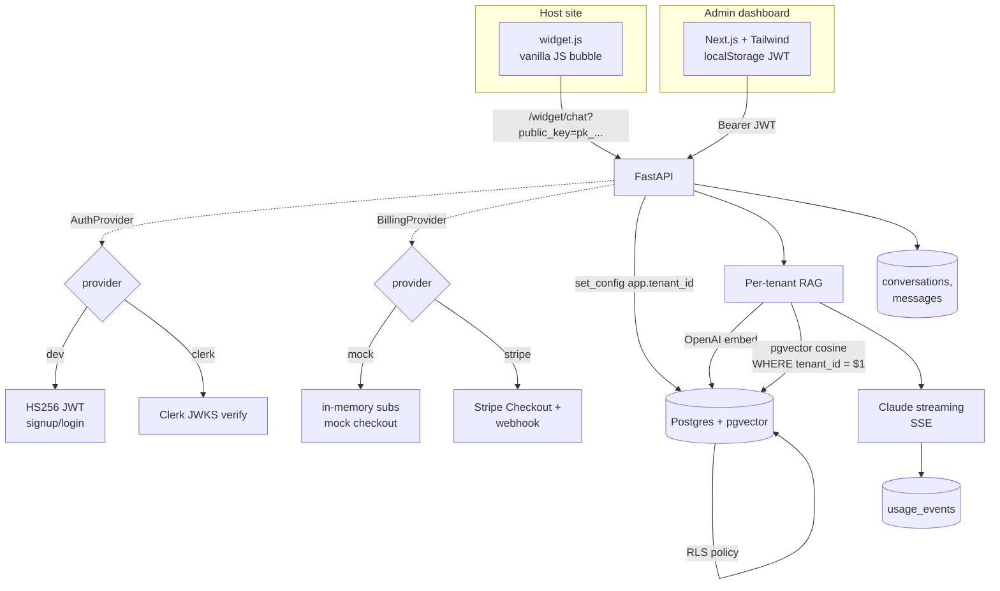

# Architecture



## Tenant isolation — two independent layers

Every tenant-scoped table has `tenant_id NOT NULL` plus a Postgres RLS policy:

```sql
ALTER TABLE chunks ENABLE ROW LEVEL SECURITY;
CREATE POLICY tenant_isolation ON chunks
USING (
    tenant_id::text = current_setting('app.tenant_id', true)
    OR current_setting('app.tenant_id', true) = ''
)
WITH CHECK (
    tenant_id::text = current_setting('app.tenant_id', true)
);
```

The FastAPI dependency `tenant_scoped_session` calls
`SELECT set_config('app.tenant_id', :t, true)` after auth. The `true` flag
scopes the setting to the current transaction, so a pooled connection
returning to the pool clears it automatically.

Application code *also* filters by `tenant_id` in every query — defense in
depth. The RLS policy is the safety net for any code path that forgets.

The widget chat endpoint authenticates by a tenant-public key
(`pk_<urlsafe>`), looks up the tenant *with the GUC cleared*, then sets
the GUC for the rest of the request. Public-key auth never grants admin
operations — only the widget chat surface.

## Auth + billing as Protocols

`AuthProvider` and `BillingProvider` are `typing.Protocol`s. Each has two
implementations:

| Provider | dev/mock                              | production              |
| -------- | ------------------------------------- | ----------------------- |
| Auth     | HS256 JWTs, in-process signup/login   | Clerk JWKS verification |
| Billing  | In-memory subscriptions, mock checkout| Stripe Checkout + webhook |

The dashboard never branches on which provider is active. Switching is one
env var: `AUTH_PROVIDER=clerk`, `BILLING_PROVIDER=stripe` plus the relevant
credentials. The same `AppShell`, the same dashboards, the same API routes
— this is what "behind real interfaces" buys you.

## Plan limits

`PLAN_LIMITS[Plan]` defines doc + monthly-message caps. Limits are checked
inline:

- `ingest_pdf` raises `IngestError` before storing a doc that would exceed
  the per-tenant doc cap.
- `stream_chat` raises `PlanLimitExceeded` before any LLM call if the
  tenant has hit the month's assistant-message cap. The SSE handler
  catches this and emits a friendly `error` event so the widget shows it.

Upgrade routes through `BillingProvider.create_checkout`. The mock provider
returns a synthetic URL the frontend treats like a Stripe hosted-checkout
URL; clicking through `POSTS /billing/mock/confirm` to flip the plan and
exercise the same code path that Stripe's webhook would.

## Cost tracking

Every LLM call writes a `usage_events` row with `prompt_tokens`,
`completion_tokens`, and a `cost_usd` computed via `core/pricing.py`
(public list prices). The admin overview rolls up daily and monthly cost
per tenant. Cost is attributed to the tenant_id set in the GUC at the time
of the call, so cross-tenant leakage is detected the same way data
leakage would be.

## Embeddable widget

`widget.js` (~5 KB) is a vanilla JS script that mounts a floating chat
bubble on any host page using only the tenant's public key. End-user
sessions live in `localStorage` keyed by public key, so conversation
history survives page reloads on the host site. The widget streams via
fetch + readable-stream parsing (it does not use `EventSource`, because
EventSource can't POST or send headers).
